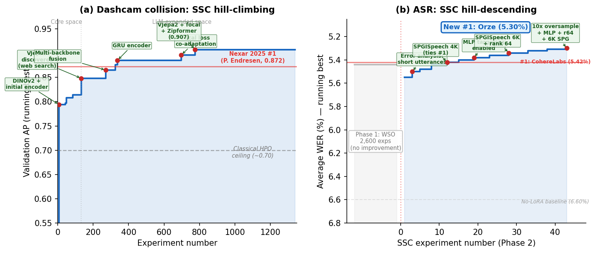

# Auto Research Is Not Auto Tuning: Convergence Analysis of 10,000 LLM-Guided Experiments

This repository is the official implementation of **Auto Research Is Not Auto Tuning: Convergence Analysis of 10,000 LLM-Guided Experiments** (NeurIPS 2026).

> We disentangle *search space construction* (SSC -- discovering which architectures and backbones to try) from *within-space optimization* (WSO -- tuning hyperparameters in a fixed space) across 10,000+ experiments on two vision tasks. Two LLM agents autonomously identified V-JEPA 2, composed multi-backbone fusion, and wrote integration code -- raising the achievable mAP from 0.70 to 0.737. ANOVA confirms backbone choice alone explains 48% of test variance; all hyperparameters combined explain <5%.

<p align="center">
  
</p>

## Requirements

**Python >= 3.10** and **CUDA >= 12.1** are required.

To install dependencies:

```bash
pip install -r requirements.txt
```

To install the Orze orchestrator (used to run the full LLM-guided campaign):

```bash
pip install -e ./orze
pip install -e ./orze-pro   # optional: LLM-guided research roles
```

### Dataset

The experiments use the [Nexar Dashcam Collision Prediction](https://www.kaggle.com/competitions/nexar-collision-prediction) dataset. Download and extract, then set environment variables:

```bash
export NEXAR_TRAIN_DIR=/path/to/nexar/train       # Training videos
export NEXAR_TRAIN_CSV=/path/to/nexar/train.csv    # Training labels
export NEXAR_TEST_DIR=/path/to/nexar/test           # Test videos (1,344 clips)
export NEXAR_TEST_CSV=/path/to/nexar/solution.csv   # Test labels (held-out)
```

### Feature Extraction

Pre-extracted backbone features are required for the frozen-feature experiments (Recipe A). Extract features using DINOv2 / V-JEPA 2 / SigLIP2:

```bash
# Example: DINOv2-ViT-B/14 features
python training/train.py --extract-features \
  --backbone dinov2_vitb14 \
  --video-dir <DATA_DIR>/train \
  --output-dir features/nexar
```

## Training

### Recipe A: Frozen-Feature Temporal Classifier (LLM-Guided Campaign)

This is the primary experimental setup from the paper. The Orze orchestrator manages the experiment loop: LLM agents propose configurations, Orze trains them on available GPUs, and results feed back to the agents.

```bash
cd training/

# Single experiment (manual)
python train.py \
  --idea-id idea-495 \
  --results-dir results \
  --ideas-md ideas.md \
  --config configs/base.yaml

# Full LLM-guided campaign via Orze
orze run --config orze.yaml
```

Key configuration parameters (see `training/configs/base.yaml`):

| Parameter | Default | Description |
|-----------|---------|-------------|
| `backbone` | `dinov2_vitb14` | Vision backbone for feature extraction |
| `model.type` | `transformer` | Temporal encoder architecture |
| `model.hidden_dim` | 256 | Encoder hidden dimension |
| `training.lr` | 3e-4 | Learning rate |
| `training.epochs` | 60 | Training epochs |
| `training.pos_weight` | 2.8 | Positive class weight |

### Recipe B: End-to-End MViTv2 Fine-Tuning

```bash
cd training/

python train_e2e.py \
  --gpu 0 \
  --idea_id e2e_mvit_v2_s_run1 \
  --lr 2e-5 \
  --epochs 30 \
  --eval_every 5 \
  --eval_sample_stride 30 \
  --save_every_eval
```

### Model Soup (Ensemble)

```bash
cd training/
python model_soup.py --results-dir results --top-k 5
```

## Evaluation

To evaluate a trained checkpoint on the held-out test set:

```bash
# Recipe A: Frozen-feature model
# (Evaluation is integrated into train.py — test mAP is reported in metrics.json)

# Recipe B: End-to-end checkpoint
python evaluation/eval_e2e.py \
  results/<run_id>/best_model.pt \
  --stride 30 \
  --gpu 0

# With test-time augmentation
python evaluation/eval_e2e_tta.py \
  results/<run_id>/best_model.pt \
  --stride 15 \
  --gpu 0
```

## Pre-trained Models

Top-3 winning model recipes from 639 validated experiments:

| Model | AUC-ROC | F1 | Recall | Precision | Backbone | Params |
|-------|---------|-----|--------|-----------|----------|--------|
| [mustan-vitb-zipformer](models/collision-winners/mustan-vitb-zipformer/) | 0.788 | 0.769 | 0.833 | 0.714 | DINOv2-ViT-B/14 | 125.7M |
| [nexvitad-bottleneck-zipformer](models/collision-winners/nexvitad-bottleneck-zipformer/) | 0.758 | 0.762 | 0.667 | 0.889 | DINOv2-ViT-B/14 | 104.2M |
| [ttc-geometric-vitl-zipformer](models/collision-winners/ttc-geometric-vitl-zipformer/) | 0.705 | 0.828 | 1.000 | 0.706 | DINOv2-ViT-L/14 | 348.6M |

Each model directory contains `recipe.yaml` (full config to reproduce), `metrics.json`, and `validation_report.json`.

To reproduce the top model:

```bash
cd training/
python train.py \
  --idea-id mustan-vitb-zipformer \
  --config ../models/collision-winners/mustan-vitb-zipformer/recipe.yaml \
  --results-dir results
```

### Downloading Pre-trained Checkpoints

Top-3 trained temporal classifier checkpoints are hosted on Hugging Face:
**https://huggingface.co/warlockee/orze-nips-models**

```python
from huggingface_hub import hf_hub_download
import torch

ckpt_path = hf_hub_download(
    repo_id="warlockee/orze-nips-models",
    filename="idea-502970/best_model.pt"
)
ckpt = torch.load(ckpt_path, map_location="cpu", weights_only=False)
```

| HF Checkpoint | Test mAP | Size |
|--------------|----------|------|
| `idea-502970/best_model.pt` | **0.7853** | 24 MB |
| `idea-eb79fc/best_model.pt` | 0.7816 | 11 MB |
| `idea-2c0263/best_model.pt` | 0.7802 | 24 MB |

Each checkpoint directory also contains `idea_config.yaml` and `metrics.json`.

## Results

### Main Results: Search Space Construction vs. Within-Space Optimization

Backbone choice alone explains 48% of held-out test variance; all hyperparameters combined explain <5%.

| Policy | Search Space | Best mAP | Notes |
|--------|-------------|----------|-------|
| **LLM Agent** | Self-constructed | **0.727** | Discovered V-JEPA 2, multi-backbone fusion |
| Uniform Random | LLM-constructed | **0.737** | Oracle-selected on test set |
| TPE | LLM-constructed | 0.715 | 8 seeds |
| SMAC (conditional) | LLM-constructed | 0.675 | 8 seeds |
| Uniform Random | Core (original) | 0.700 | Original backbone space |
| SMAC (conditional) | Core (original) | 0.694 | Original backbone space |

### ANOVA Decomposition (Competition mAP)

| Factor | eta-squared | 95% CI |
|--------|------------|--------|
| Backbone | 0.48 (adaptive) / 0.20 (i.i.d.) | [0.16, 0.25] |
| Encoder type | 0.08 | [0.04, 0.13] |
| Learning rate | 0.006 | [0.001, 0.016] |
| All HPs combined | < 0.05 | -- |

### Cross-Task Validation (UCF-101)

| Factor | eta-squared | Winner |
|--------|------------|--------|
| Architecture | 0.148 | SigLIP2 (not V-JEPA 2) |
| Best top-1 accuracy | 0.964 | SMAC baseline |

### End-to-End LoRA Ablation (n=372)

Under gradient-based adaptation, architecture eta-squared drops 4x while learning rate eta-squared rises to 0.79.

### ASR Transfer

The LLM-constructed search space also achieved **#1 and #2 on the Open ASR Leaderboard** (5.30% and 5.36% WER).

### Reproducing Tables and Figures

```bash
cd analysis/

# Individual analyses
python scripts/compute_anova.py           # Table 3: ANOVA decomposition
python scripts/compute_convergence.py     # Table 5 + Figure 2: convergence curves
python scripts/compute_agent_dynamics.py  # Figure 3: multi-agent entropy/JSD
python scripts/compute_ablation.py        # Table 6: obfuscated-names ablation
python scripts/compute_genealogy.py       # Experiment genealogy tree
python scripts/generate_figures.py        # All paper figures (PDF)

# Or run all at once
python scripts/fill_paper_values.py --force
```

## Repository Structure

```
orze-nips/
├── README.md                          # This file
├── LICENSE
├── requirements.txt                   # Python dependencies
├── orze/                              # Orze orchestrator (submodule)
├── orze-pro/                          # Orze Pro — LLM research roles (submodule)
├── training/
│   ├── train.py                       # Recipe A: frozen-feature temporal classifier
│   ├── train_e2e.py                   # Recipe B: end-to-end MViTv2 fine-tuning
│   ├── model_soup.py                  # Model soup ensemble
│   ├── curate_data.py                 # Data curation utilities
│   ├── orze.yaml                      # Orze orchestration config
│   └── configs/
│       └── base.yaml                  # Default hyperparameters
├── evaluation/
│   ├── eval_e2e.py                    # mAP evaluation for Recipe B
│   ├── eval_e2e_tta.py                # Test-time augmentation evaluation
│   └── analyze_predictions.py         # Prediction analysis & error breakdown
├── models/
│   └── collision-winners/             # Top-3 model recipes + metrics
│       ├── mustan-vitb-zipformer/
│       ├── nexvitad-bottleneck-zipformer/
│       └── ttc-geometric-vitl-zipformer/
├── analysis/
│   ├── scripts/                       # Paper figure & table generation
│   │   ├── compute_anova.py           # ANOVA decomposition
│   │   ├── compute_convergence.py     # Convergence analysis
│   │   ├── compute_agent_dynamics.py  # Multi-agent dynamics
│   │   ├── compute_ablation.py        # Ablation studies
│   │   ├── compute_genealogy.py       # Experiment genealogy
│   │   ├── generate_figures.py        # All paper figures
│   │   └── fill_paper_values.py       # Master script: compute all + fill paper
│   └── data/                          # Pre-computed JSON (experiment summaries)
├── paper/
│   ├── paper_formal.tex               # LaTeX source
│   ├── paper_formal.pdf               # Compiled PDF
│   ├── neurips_2026.sty               # NeurIPS style file
│   ├── figures/                       # Paper figures (PDF)
│   └── computed_values/               # Values inserted into paper
└── experiments/                       # Full experiment logs (see below)
```

## Experiment Data

The full experiment logs (4,233 collision-detection experiments with metrics.json and idea_config.yaml per run) are hosted on Hugging Face Datasets:

**https://huggingface.co/datasets/warlockee/orze-nips-experiments**

```python
from huggingface_hub import snapshot_download

local_dir = snapshot_download(
    repo_id="warlockee/orze-nips-experiments",
    repo_type="dataset"
)
# Experiments are in: {local_dir}/nexar_experiments/idea-*/
```

To run the paper analysis against the downloaded data:

```bash
export RESULTS_DIR=$(python -c "from huggingface_hub import snapshot_download; print(snapshot_download('warlockee/orze-nips-experiments', repo_type='dataset'))")/nexar_experiments

cd analysis/
python scripts/compute_anova.py
python scripts/compute_convergence.py
python scripts/generate_figures.py
```

## Citation

```bibtex
@inproceedings{anonymous2026autoresearch,
  title={Auto Research Is Not Auto Tuning: Convergence Analysis of 10,000 {LLM}-Guided Experiments},
  author={Anonymous},
  booktitle={Advances in Neural Information Processing Systems (NeurIPS)},
  year={2026}
}
```

## License

This project is licensed under the MIT License - see the [LICENSE](LICENSE) file for details.
